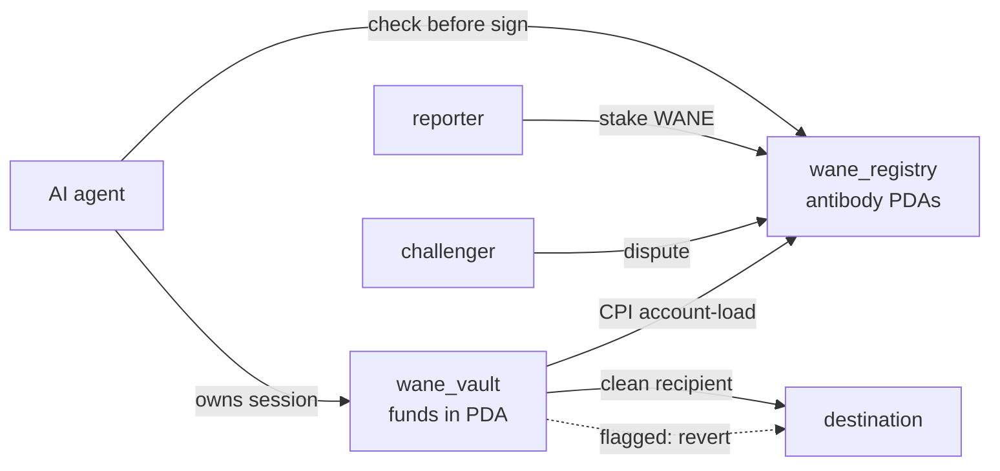

<p align="center">
  
</p>

<p align="center">
  <a href="https://github.com/WaneProtocol/wane-solana/blob/main/LICENSE"></a>
  <a href="https://github.com/WaneProtocol/wane-solana/actions"></a>
  
  
  
  <a href="https://wane.network"></a>
  <a href="https://x.com/wanedotnetwork"></a>
</p>

Shared on-chain immune memory for AI agents, with a non-custodial session wallet that screens outflows before value moves.

When one agent gets drained, the address (or call pattern, bytecode, or semantic fingerprint) is published once as an antibody. Every other agent that reads the registry before signing is then immune to the same threat. Reading is a plain account lookup, so there is no view call and no per-read cost.

This is the Solana port of the Base/EVM Wane protection layer.

## Architecture



The vault never holds custody of intent: the owner drives every send, the program can only block. The antibody account passed to the vault is bound by PDA seeds to the destination, so the screen cannot be skipped.

## Programs

| Program | ID (devnet and mainnet) |
| --- | --- |
| `wane_registry` | `5Arj4zbFs5GigEGUSUb9hKNMYaPLqv1XgJXUcnGJ1wJH` |
| `wane_vault` | `5YK7gMzkjUvLaxfNisMdtjRK4UeAiJBCSonB3GgrtTYh` |

### wane_registry

The antibody registry. One antibody is one PDA keyed by `(kind, subject)`, so the PDA address itself is the dedup key. It carries a stake/corroborate/challenge/resolve economy denominated in the `$WANE` SPL token, plus protocol-owned genesis antibodies that enforce immediately. Governance is a two-step transfer, the economic params are updatable, and the registry can be paused.

### wane_vault

A non-custodial session-key smart account. Funds live in a program-owned vault PDA, the owner drives every send, and the program can only block, never divert. `wane_execute` screens each native-SOL outflow against the registry and the agent's own policy (per-tx cap, daily cap, expiry, kill switch) and reverts before any lamport moves if the destination is flagged.

The screen cannot be bypassed: the destination's antibody account is bound by PDA seeds to the destination address, so a caller cannot omit it or swap in a clean address to slip a flagged send through. The owner can always `withdraw` their own funds, so deposits are never trapped.

## SDK

`sdk/` is a dependency-light TypeScript client (`@solana/web3.js` only) covering both integration paths:

- Bot developers: `check(target)` before signing and `report(threat)` on a hit. No custody, no migration, one call.
- Personal agents: enroll a Wane session wallet, deposit, and route sends through `send`, which the program screens on-chain.

```ts
import { Wane } from "wane-solana";
const wane = Wane.devnet();
const v = await wane.checkAddress(target); // { flagged: true, antibody: {...} }
```

Instruction data is the 8-byte Anchor discriminator plus borsh, matching the deployed programs. `sdk/test/encoding.test.ts` verifies the discriminators and PDA derivations against the on-chain layout.

## Build and test

```bash
git clone --recurse-submodules https://github.com/WaneProtocol/wane-solana
cd wane-solana

# programs (Anchor / cargo-build-sbf)
anchor build

# full e2e on a real SBF runtime (litesvm)
cd e2e && cargo run

# SDK type check + encoding test
cd sdk && npx tsc --noEmit && npx tsx test/encoding.test.ts
```

Build note: current devnet enables SBPFv3 only, while mainnet still takes SBPFv0/v1/v2. Build the `.so` with the matching `cargo-build-sbf --arch` for the target cluster.

## Project structure

```
programs/wane_registry   init_config, mint_antibody, corroborate, seed_genesis, challenge, resolve, claim_rewards, update_config, governance
programs/wane_vault      enroll, deposit, wane_execute, withdraw, update_policy, set_paused
sdk                      TypeScript client (both personas)
e2e                      litesvm end-to-end suite
tests                    bankrun end-to-end (TypeScript)
```

## Links

- Website: https://wane.network
- X: https://x.com/wanedotnetwork
- GitHub: https://github.com/WaneProtocol/wane-solana

## License

MIT
