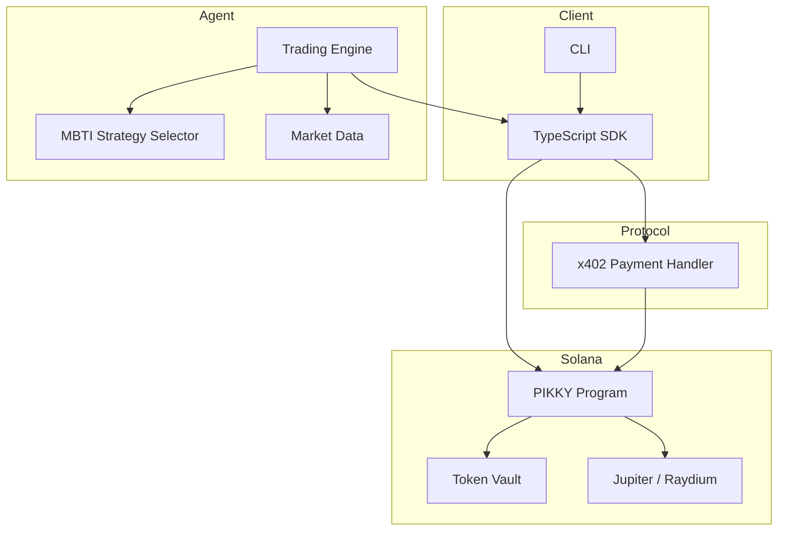

# PIKKY

<p align="center">
  
</p>

[](https://github.com/Pikky2026/PIKKY/actions)
[](LICENSE)
[](https://solana.com)
[](#x402-protocol)
[](https://x.com/Pikkydotfun)
[](https://pikky.fun/)

The world's first MBTI-based x402 auto-trading AI agent on Solana. PIKKY assigns
one of 16 personality-driven trading strategies to your portfolio, then executes
trades autonomously using on-chain payment verification through the x402 protocol.

Pick a personality. Fund the vault. Let PIKKY trade.

---

## How It Works

1. **Deposit** SOL or SPL tokens into the on-chain vault.
2. **Choose** your MBTI personality type (INTJ, ENFP, ISTJ, ...).
3. **Enable** auto-trading. PIKKY's AI agent monitors markets 24/7.
4. **Pay-per-trade** via x402 -- every agent action is gated by a verifiable on-chain micropayment.
5. **Withdraw** anytime. Your funds, your keys, your personality.

---

## Architecture



**On-chain program** (Rust/Anchor) manages vaults, user state, trade execution via
CPI to Jupiter/Raydium, and x402 payment verification.

**TypeScript SDK** provides a client library for interacting with the program,
building x402 payment transactions, and querying state.

**Python agent** runs the AI trading engine, implements all 16 MBTI strategies,
generates signals from market data, and executes trades through the SDK.

---

## Quick Start

### Prerequisites

- Rust 1.75+
- Node.js 20+
- Python 3.11+
- Solana CLI 1.18+
- Anchor 0.30+

### Installation

```bash
git clone https://github.com/Pikky2026/PIKKY.git
cd pikky

# Automated setup
chmod +x scripts/setup.sh
./scripts/setup.sh
```

### Manual Setup

```bash
# Build Solana program
cd programs && cargo build && cd ..

# Install SDK
cd sdk && npm install && npm run build && cd ..

# Install agent
cd agent && python -m venv .venv && source .venv/bin/activate
pip install -r requirements.txt && cd ..
```

### Run Tests

```bash
# Rust
cd programs && cargo test

# TypeScript
cd sdk && npm test

# Python
cd agent && pytest tests/ -v

# Integration
pytest tests/integration/ -v
```

### Deploy (devnet)

```bash
chmod +x scripts/deploy.sh
./scripts/deploy.sh devnet
```

---

## MBTI Trading Strategies

Each personality type maps to a distinct trading strategy with unique risk
parameters, indicator preferences, and execution style.

| Type | Style | Risk | Max Position | Stop Loss | Take Profit |
|------|-------|------|-------------|-----------|-------------|
| INTJ | Trend following | 0.65 | 30% | 8% | 25% |
| INTP | Mean reversion | 0.40 | 10% | 4% | 6% |
| ENTJ | Breakout trading | 0.80 | 35% | 5% | 15% |
| ENTP | Contrarian plays | 0.70 | 15% | 10% | 30% |
| INFJ | Thematic investing | 0.50 | 25% | 12% | 40% |
| INFP | Buy and hold | 0.35 | 20% | 15% | 50% |
| ENFJ | Sentiment trend | 0.60 | 25% | 7% | 20% |
| ENFP | Momentum breakout | 0.75 | 8% | 6% | 20% |
| ISTJ | Systematic rules | 0.25 | 15% | 3% | 8% |
| ISFJ | Capital preservation | 0.15 | 10% | 2% | 5% |
| ESTJ | Swing trading | 0.45 | 20% | 4% | 10% |
| ESFJ | Social copy trading | 0.35 | 12% | 5% | 10% |
| ISTP | Scalping | 0.55 | 20% | 2% | 4% |
| ISFP | Pattern recognition | 0.30 | 12% | 3% | 9% |
| ESTP | Aggressive momentum | 0.90 | 40% | 6% | 15% |
| ESFP | Hype trading | 0.70 | 6% | 8% | 25% |

Full strategy documentation: [docs/mbti-strategies.md](docs/mbti-strategies.md)

---

## x402 Protocol

PIKKY uses x402 for pay-per-use AI trading services. When a client requests
a premium endpoint, the server returns HTTP 402 with payment instructions.
The client pays on-chain and retries with proof.

```
Client                    Server                   Solana
  |                         |                        |
  |-- GET /api/trade ------>|                        |
  |<-- 402 + payment info --|                        |
  |                         |                        |
  |-- Transfer SOL ---------|----------------------->|
  |<-- tx signature --------|------------------------|
  |                         |                        |
  |-- GET /api/trade ------>|                        |
  |   + X-Payment-Signature |-- verify on-chain ---->|
  |                         |<-- confirmed ----------|
  |<-- 200 + trade result --|                        |
```

| Endpoint | Cost |
|----------|------|
| `POST /api/agent/trade` | 0.01 SOL |
| `POST /api/agent/analyze` | 0.005 SOL |
| `GET /api/agent/signals` | 0.002 SOL |
| `POST /api/agent/strategy` | 0.001 SOL |
| `GET /api/portfolio` | Free |
| `POST /api/deposit` | Free |
| `POST /api/withdraw` | Free |

Full spec: [docs/x402-spec.md](docs/x402-spec.md)

---

## SDK Usage

### TypeScript

```typescript
import { PikkyClient, MBTIType } from '@pikky/sdk';
import { Connection, Keypair } from '@solana/web3.js';

const connection = new Connection('https://api.mainnet-beta.solana.com');
const wallet = loadWalletFromFile('./wallet.json');

const client = new PikkyClient({ connection, wallet });

// Initialize user account
await client.initialize();

// Deposit 5 SOL
await client.deposit(5.0);

// Set personality
await client.setMBTIType(MBTIType.INTJ);

// Enable auto-trading
await client.setAutoTrading(true);

// Check status
const status = await client.getStatus();
console.log(`Balance: ${status.currentBalance}`);
console.log(`PnL: ${status.realizedPnl}`);
console.log(`Trades: ${status.totalTrades}`);
console.log(`Win rate: ${status.winningTrades / status.totalTrades}`);

// Manual trade
await client.executeTrade({
  side: 'buy',
  inputMint: SOL_MINT,
  outputMint: USDC_MINT,
  amount: 1_000_000_000,
  slippageBps: 50,
});

// Withdraw everything
await client.withdrawAll();
```

### x402 Payment Flow

```typescript
import { X402Client } from '@pikky/sdk';

const x402 = new X402Client({ connection, wallet, network: 'solana:mainnet-beta' });

// Automatically handles 402 -> pay -> retry
const result = await x402.requestWithPayment('https://api.pikky.sol/api/agent/trade', {
  method: 'POST',
  body: JSON.stringify({ pair: 'SOL/USDC', mbti: 'INTJ' }),
});

console.log(result.trade);
```

---

## API Usage

### Deposit Funds

```bash
curl -X POST https://api.pikky.sol/api/deposit \
  -H "Content-Type: application/json" \
  -d '{"amount": 5000000000, "wallet": "YOUR_PUBKEY"}'
```

### Set MBTI Type

```bash
curl -X POST https://api.pikky.sol/api/mbti \
  -H "Content-Type: application/json" \
  -d '{"type": "INTJ", "wallet": "YOUR_PUBKEY"}'
```

### Execute Trade (requires x402 payment)

```bash
# First request returns 402
curl -X POST https://api.pikky.sol/api/agent/trade \
  -H "Content-Type: application/json" \
  -d '{"pair": "SOL/USDC"}'

# Response: 402 with X-Payment-* headers
# Pay on-chain, then retry with proof:

curl -X POST https://api.pikky.sol/api/agent/trade \
  -H "Content-Type: application/json" \
  -H "X-Payment-Signature: YOUR_TX_SIG" \
  -H "X-Payment-Nonce: NONCE_FROM_402" \
  -d '{"pair": "SOL/USDC"}'
```

### Check Portfolio

```bash
curl https://api.pikky.sol/api/portfolio?wallet=YOUR_PUBKEY
```

---

## CLI Usage

```bash
# Initialize
pikky init --wallet ./wallet.json

# Deposit
pikky deposit --amount 5.0

# Set personality
pikky mbti set INTJ

# View strategy parameters
pikky mbti info INTJ

# Enable auto-trading
pikky auto-trade enable

# Check status
pikky status

# View trade history
pikky trades --limit 20

# Check PnL
pikky pnl

# Withdraw
pikky withdraw --amount 2.5
pikky withdraw --all

# Emergency stop
pikky emergency-stop
```

---

## Project Structure

```
pikky/
  programs/              Solana program (Rust / Anchor)
    src/
      lib.rs             Program entrypoint
      instructions/      Instruction handlers
      state/             Account definitions
      x402.rs            Payment verification
      errors.rs          Error types
  sdk/                   TypeScript SDK
    src/
      client.ts          Main client
      x402.ts            x402 utilities
      mbti.ts            MBTI definitions
      types.ts           Type exports
  agent/                 Python trading agent
    src/
      engine.py          Trading engine
      strategies.py      MBTI strategies
      x402_handler.py    Payment handler
      market.py          Market data
  tests/                 Test suites
    sdk/                 SDK unit tests
    agent/               Agent unit tests
    integration/         End-to-end tests
  docs/                  Documentation
  scripts/               Build and deploy scripts
```

---

## Documentation

- [System Architecture](docs/architecture.md)
- [x402 Protocol Specification](docs/x402-spec.md)
- [MBTI Trading Strategies](docs/mbti-strategies.md)
- [Contributing Guide](CONTRIBUTING.md)
- [Security Policy](SECURITY.md)

---

## Contributing

Contributions are welcome. See [CONTRIBUTING.md](CONTRIBUTING.md) for setup
instructions, coding standards, and the PR process.

---

## Security

Found a vulnerability? See [SECURITY.md](SECURITY.md) for responsible disclosure
instructions. Do not open a public issue for security problems.

---

## License

MIT License. See [LICENSE](LICENSE).

---

## Links

- X: [https://x.com/Pikkydotfun](https://x.com/Pikkydotfun)
- Website: [https://pikky.fun/](https://pikky.fun/)
