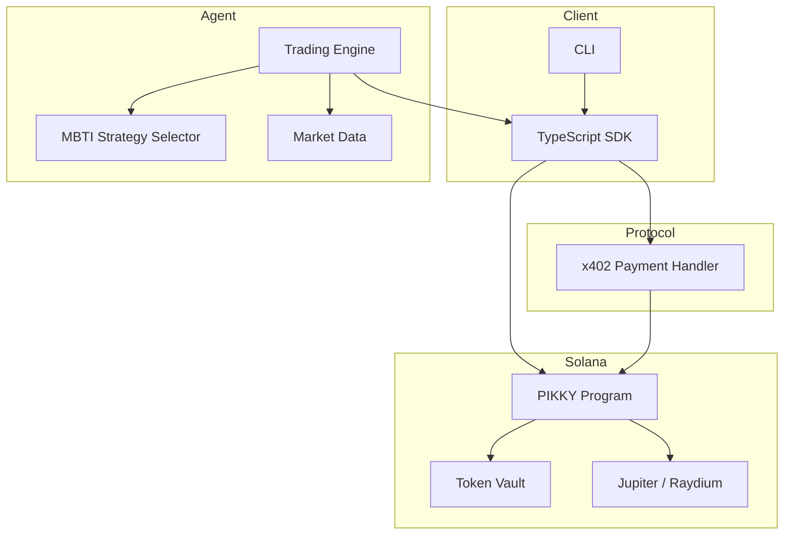

# PIKKY

[](https://github.com/Pikky2026/PIKKY/actions)
[](LICENSE)
[](https://solana.com)
[](#x402-protocol)
[](https://x.com/Pikkydotfun)
[](https://pikky.fun/)

The world's first MBTI-based x402 auto-trading AI agent on Solana. PIKKY assigns
one of 16 personality-driven trading strategies to your portfolio, then executes
trades autonomously using on-chain payment verification through the x402 protocol.

Pick a personality. Fund the vault. Let PIKKY trade.

---

## How It Works

1. **Deposit** SOL or SPL tokens into the on-chain vault.
2. **Choose** your MBTI personality type (INTJ, ENFP, ISTJ, ...).
3. **Enable** auto-trading. PIKKY's AI agent monitors markets 24/7.
4. **Pay-per-trade** via x402 -- every agent action is gated by a verifiable on-chain micropayment.
5. **Withdraw** anytime. Your funds, your keys, your personality.

---

## Architecture



**On-chain program** (Rust/Anchor) manages vaults, user state, trade execution via
CPI to Jupiter/Raydium, and x402 payment verification.

**TypeScript SDK** provides a client library for interacting with the program,
building x402 payment transactions, and querying state.

**Python agent** runs the AI trading engine, implements all 16 MBTI strategies,
generates signals from market data, and executes trades through the SDK.

---

## Quick Start

### Prerequisites

- Rust 1.75+
- Node.js 20+
- Python 3.11+
- Solana CLI 1.18+
- Anchor 0.30+

### Installation

```bash
git clone https://github.com/Pikky2026/PIKKY.git
cd pikky

# Automated setup
chmod +x scripts/setup.sh
./scripts/setup.sh
```

### Manual Setup

```bash
# Build Solana program
cd programs && cargo build && cd ..

# Install SDK
cd sdk && npm install && npm run build && cd ..

# Install agent
cd agent && python -m venv .venv && source .venv/bin/activate
pip install -r requirements.txt && cd ..
```

### Run Tests

```bash
# Rust
cd programs && cargo test

# TypeScript
cd sdk && npm test

# Python
cd agent && pytest tests/ -v

# Integration
pytest tests/integration/ -v
```

### Deploy (devnet)

```bash
chmod +x scripts/deploy.sh
./scripts/deploy.sh devnet
```

---

## MBTI Trading Strategies

Each personality type maps to a distinct trading strategy with unique risk
parameters, indicator preferences, and execution style.

| Type | Style | Risk | Max Position | Stop Loss | Take Profit |
|------|-------|------|-------------|-----------|-------------|
| INTJ | Trend following | 0.65 | 30% | 8% | 25% |
| INTP | Mean reversion | 0.40 | 10% | 4% | 6% |
| ENTJ | Breakout trading | 0.80 | 35% | 5% | 15% |
| ENTP | Contrarian plays | 0.70 | 15% | 10% | 30% |
| INFJ | Thematic investing | 0.50 | 25% | 12% | 40% |
| INFP | Buy and hold | 0.35 | 20% | 15% | 50% |
| ENFJ | Sentiment trend | 0.60 | 25% | 7% | 20% |
| ENFP | Momentum breakout | 0.75 | 8% | 6% | 20% |
| ISTJ | Systematic rules | 0.25 | 15% | 3% | 8% |
| ISFJ | Capital preservation | 0.15 | 10% | 2% | 5% |
| ESTJ | Swing trading | 0.45 | 20% | 4% | 10% |
| ESFJ | Social copy trading | 0.35 | 12% | 5% | 10% |
| ISTP | Scalping | 0.55 | 20% | 2% | 4% |
| ISFP | Pattern recognition | 0.30 | 12% | 3% | 9% |
| ESTP | Aggressive momentum | 0.90 | 40% | 6% | 15% |
| ESFP | Hype trading | 0.70 | 6% | 8% | 25% |

Full strategy documentation: [docs/mbti-strategies.md](docs/mbti-strategies.md)

---
