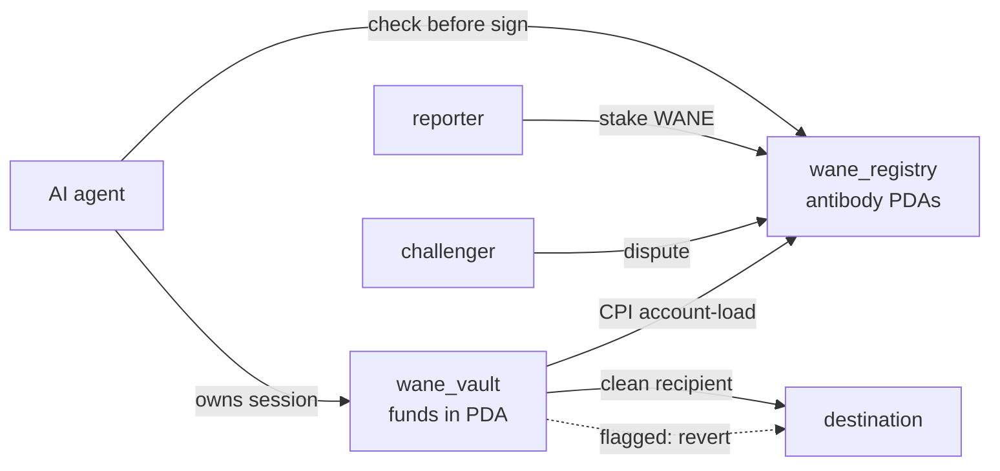

  

  
  
  
  
  
  
  

Shared on-chain immune memory for AI agents, with a non-custodial session wallet that screens outflows before value moves.

When one agent gets drained, the address (or call pattern, bytecode, or semantic fingerprint) is published once as an antibody. Every other agent that reads the registry before signing is then immune to the same threat. Reading is a plain account lookup, so there is no view call and no per-read cost.

This is the Solana port of the Base/EVM Wane protection layer.

## Architecture

