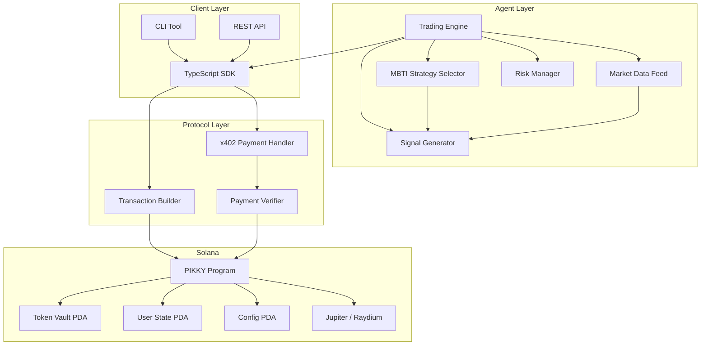
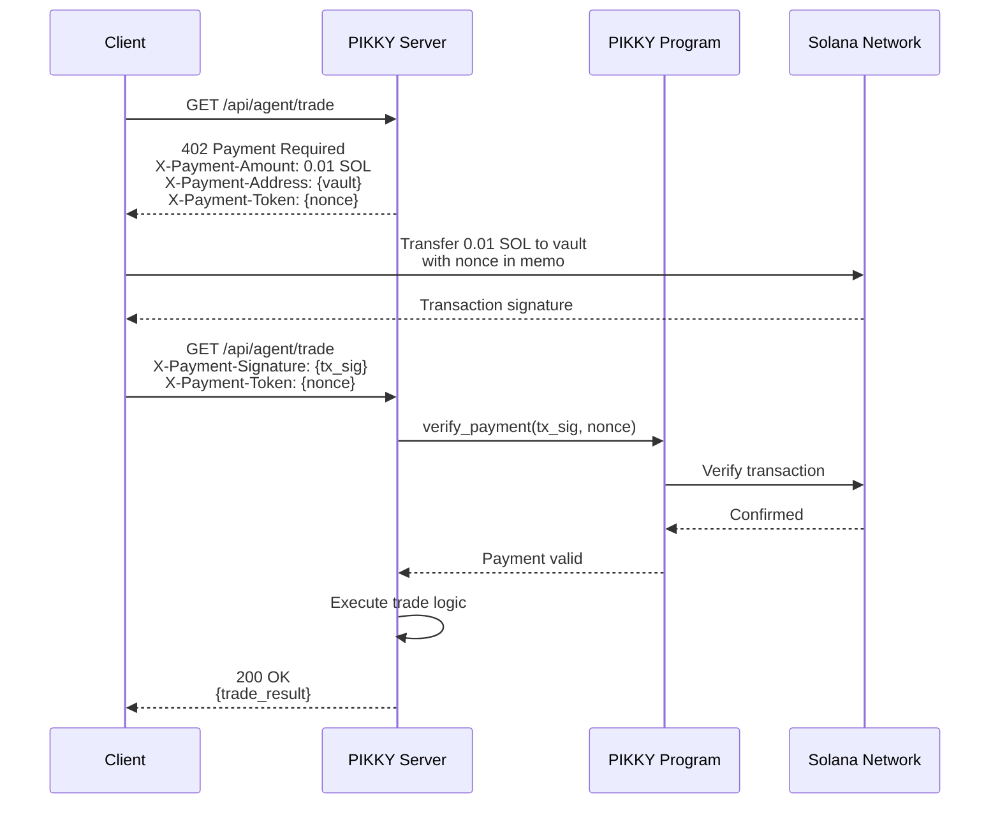
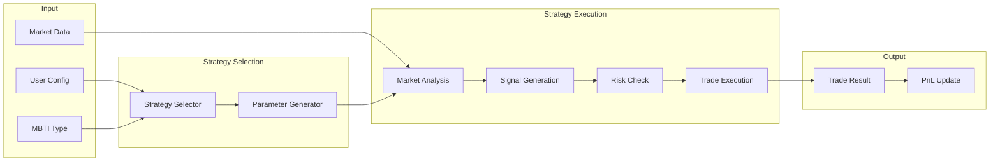
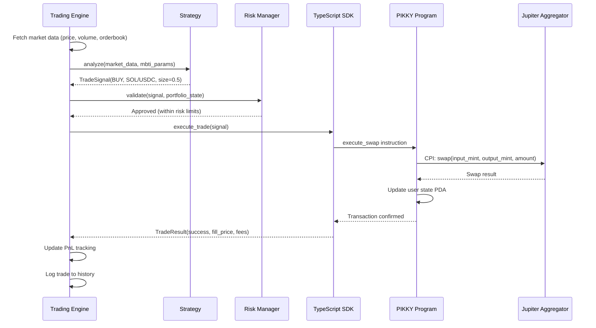
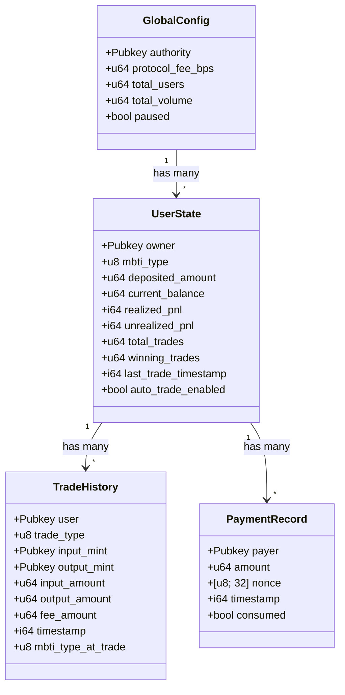
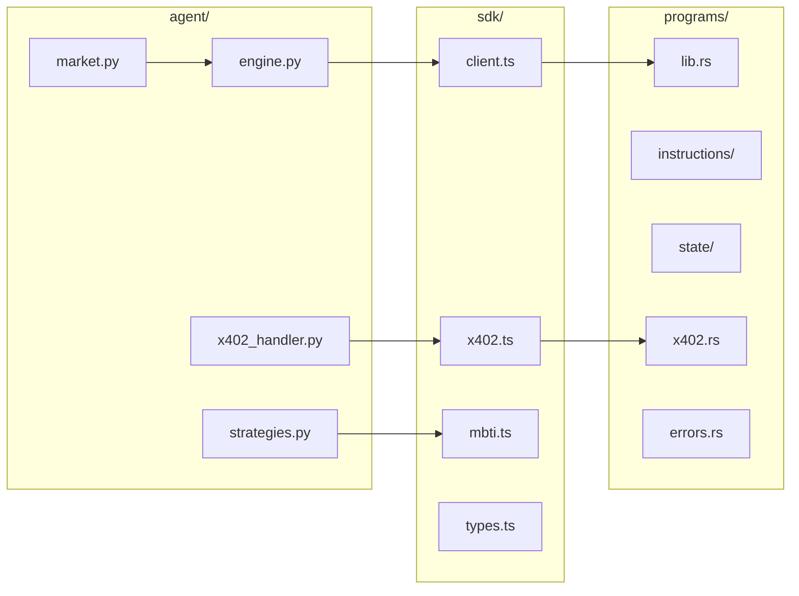

# PIKKY System Architecture

## Overview

PIKKY is an x402-based Solana auto-trading AI agent that uses MBTI personality
types to drive trading strategies. The system consists of three primary layers:

1. **On-Chain Program** -- Solana program managing funds, trade execution, and x402 payment verification
2. **TypeScript SDK** -- Client library for interacting with the on-chain program
3. **Python Agent** -- AI-powered trading engine implementing MBTI-based strategies

## High-Level Architecture



## x402 Payment Flow

The x402 protocol enables HTTP 402 Payment Required flows for accessing
premium trading features and AI agent services.



### Payment Header Specification

| Header | Direction | Description |
|--------|-----------|-------------|
| `X-Payment-Amount` | Response | Required payment amount in lamports |
| `X-Payment-Address` | Response | Destination vault address |
| `X-Payment-Token` | Both | Unique nonce for replay protection |
| `X-Payment-Signature` | Request | Solana transaction signature |
| `X-Payment-Network` | Response | Solana network (mainnet-beta, devnet) |

## MBTI Strategy Selection Pipeline



Each MBTI type maps to a distinct set of trading parameters:

- **Risk tolerance** (0.0 - 1.0)
- **Position sizing** (percentage of portfolio)
- **Entry aggressiveness** (how early to enter)
- **Exit strategy** (stop-loss and take-profit ratios)
- **Rebalance frequency**
- **Indicator weights** (which technical indicators to prioritize)

## Trade Execution Pipeline



## Account Structure (PDAs)



### PDA Seeds

| Account | Seeds | Bump |
|---------|-------|------|
| GlobalConfig | `["config"]` | canonical |
| UserState | `["user", owner.key()]` | canonical |
| TradeHistory | `["trade", user.key(), trade_index.to_le_bytes()]` | canonical |
| PaymentRecord | `["payment", payer.key(), nonce]` | canonical |
| TokenVault | `["vault", mint.key()]` | canonical |

## Component Interactions



## Network Topology

```
                    Internet
                       |
            +----------+----------+
            |                     |
      Solana RPC             PIKKY API
      (mainnet/devnet)       (REST + WS)
            |                     |
            |              +------+------+
            |              |             |
            |         Agent Engine   x402 Handler
            |              |             |
            +--------------+-------------+
                           |
                     PIKKY Program
                     (on-chain)
                           |
                  +--------+--------+
                  |        |        |
               Vault    States   History
```

## Data Flow Summary

1. User deposits SOL/tokens via SDK into on-chain vault.
2. User sets MBTI personality type on their UserState PDA.
3. User enables auto-trading via SDK or CLI.
4. Agent engine polls market data continuously.
5. MBTI strategy generates signals based on personality parameters.
6. Risk manager validates signals against portfolio constraints.
7. Approved trades execute via CPI to Jupiter/Raydium.
8. Trade results update UserState PDA with new balances and PnL.
9. Premium features require x402 payment before access.
10. All trades are recorded in TradeHistory PDAs for auditability.
