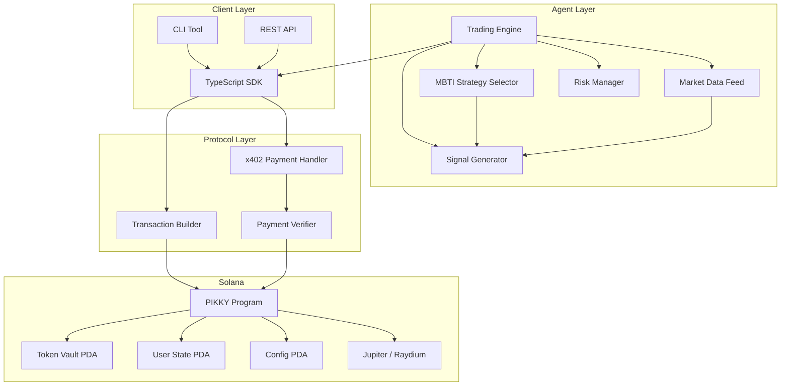
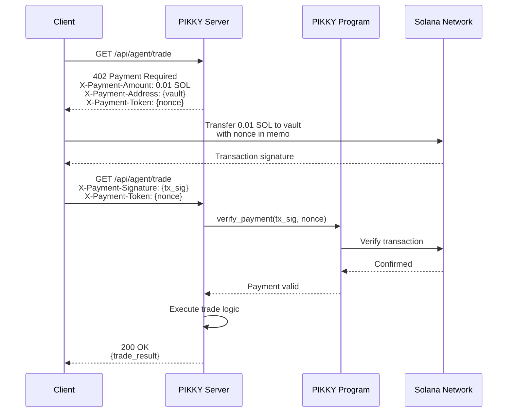

# PIKKY System Architecture

## Overview

PIKKY is an x402-based Solana auto-trading AI agent that uses MBTI personality
types to drive trading strategies. The system consists of three primary layers:

1. **On-Chain Program** -- Solana program managing funds, trade execution, and x402 payment verification
2. **TypeScript SDK** -- Client library for interacting with the on-chain program
3. **Python Agent** -- AI-powered trading engine implementing MBTI-based strategies

## High-Level Architecture

## x402 Payment Flow

The x402 protocol enables HTTP 402 Payment Required flows for accessing
premium trading features and AI agent services.

### Payment Header Specification

| Header | Direction | Description |
|--------|-----------|-------------|
| `X-Payment-Amount` | Response | Required payment amount in lamports |
| `X-Payment-Address` | Response | Destination vault address |
| `X-Payment-Token` | Both | Unique nonce for replay protection |
| `X-Payment-Signature` | Request | Solana transaction signature |
| `X-Payment-Network` | Response | Solana network (mainnet-beta, devnet) |
